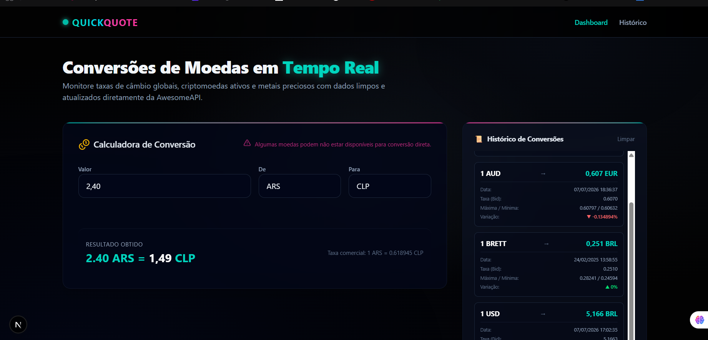
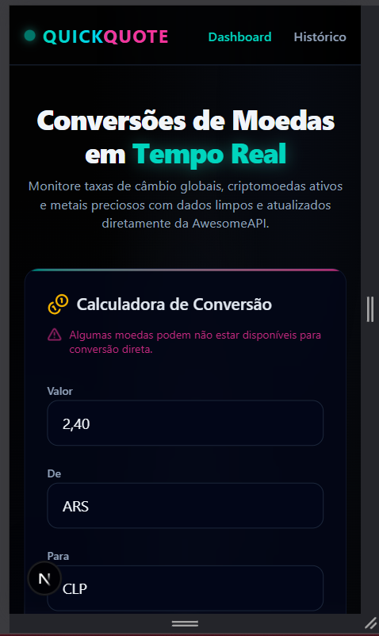

# 💱 Quick Quote


Aplicação fullstack moderna para conversão de moedas em tempo real. Construída com uma interface elegante baseada em *glassmorphism* e um fundo dinâmico, a aplicação consome dados da **AwesomeAPI** para fornecer cotações de moedas FIAT, criptomoedas e metais preciosos de forma rápida, segura e responsiva.

---

## 🎯 O Objetivo

Desenvolver um conversor de moedas que vai além de uma simples calculadora. O grande diferencial desta aplicação é o **histórico de requisições em tempo real**, que captura automaticamente cada conversão feita pelo usuário. Ele exibe dados detalhados da API, como data exata, máxima, mínima e variação percentual — tudo blindado por filtros dinâmicos que impedem a seleção de pares de moedas inválidos, garantindo a integridade dos dados e a melhor experiência de usuário.

---

## ✨ Funcionalidades

* **Conversão em Tempo Real:** Cotações atualizadas de diversas moedas e ativos globais.
* **Filtros Dinâmicos (Double-Check):** As opções de moeda de destino se adaptam automaticamente com base na moeda de origem selecionada, evitando requisições falhas.
* **Histórico Enriquecido:** Registro automático das últimas conversões, exibindo detalhes extraídos da API:
    * Data e hora exata da cotação.
    * Valor máximo e mínimo do dia.
    * Variação percentual com indicadores visuais de tendência (alta/baixa).
* **UI/UX Moderna:** Design escuro focado na legibilidade, com efeitos de blur (*backdrop-filter*), bordas neon sutis e iconografia interativa.
* **Totalmente Responsivo:** Layout modular que se adapta fluidamente entre mobile, tablet e desktop.

---

### Tela Principal (Conversor e Histórico)
Interface escura com a calculadora de conversão à esquerda e o histórico de cotações atualizado dinamicamente à direita.

### Tela Principal do Quick Quote



### Layout Responsivo (Mobile)



---

## 🛠️ Tecnologias Utilizadas

* **Framework:** Next.js (App Router)
* **Biblioteca UI:** React
* **Linguagem:** TypeScript
* **Estilização:** Tailwind CSS
* **Ícones:** Lucide React
* **Integração de Dados:** AwesomeAPI (Câmbio)

---

## ⚙️ Configuração e Execução

### Pré-requisitos
* [Node.js](https://nodejs.org/) (versão 18 ou superior)
* Gerenciador de pacotes (NPM, Yarn ou PNPM)

### Variáveis de Ambiente
Este projeto requer uma chave de API configurada. Na raiz do projeto, crie um arquivo chamado `.env.local` e adicione a sua chave da AwesomeAPI:

```env
API_KEY=sua_chave_aqui